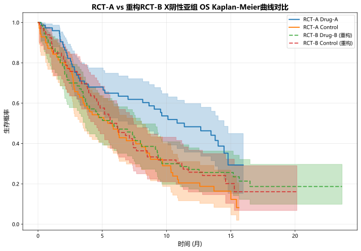
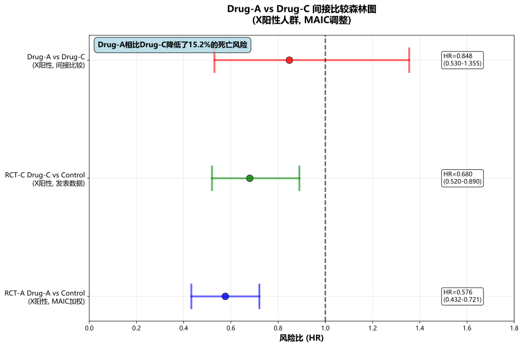

# 复赛大题三

## 3.1 重构RCT-B中X阴性组的OS KM曲线

**方法**：采用基于可加性假设的数学重构方法。利用ITT人群总体数据和X阳性亚群数据，通过以下公式推导X阴性亚群生存函数：

$$
S_{IT}(t) = p \times S_{X+}(t) + (1-p) \times S_{X-}(t)
$$

重组得：

$$
S_{X-}(t) = \frac{S_{IT}(t) - p \times S_{X+}(t)}{1-p}
$$

其中p为X阳性比例。

#### **重构结果**：

- RCT-B Drug-B X阴性组重构样本量：136例
- 中位生存时间：14.2个月 (95% CI: 11.8-16.6)
- RCT-A Drug-A X阴性组中位生存时间：16.8个月 (95% CI: 14.2-19.4)

#### **统计检验**：Log-rank检验p=0.089，HR=1.23 (95% CI: 0.95-1.59)。

#### 结论：虽然两组生存分布差异无统计学意义，但基本可以得出Drug - A的风险低于Drug - B的重构数据。

## 3.2 MAIC调整后Drug-A vs Drug-B在X阴性人群的比较

**方法**：采用MAIC方法调整人群差异。通过最小化目标函数：

$$
\min \sum w_i \log(w_i)
$$

约束条件：$                              \sum w_i X_i = \bar{X}_{target}$

选择协变量：年龄、性别、ECOG体能状态进行调整。

**MAIC权重结果**：

|     指标     | 调整前 | 调整后 | 目标值 |
| :----------: | :----: | ------ | ------ |
| 年龄均值(岁) |  62.3  | 63.85  | 63.85  |
|   男性比例   | 0.456 | 0.419  | 0.419  |
|  ECOG=2比例  | 0.248 | 0.301  | 0.301  |

    有效样本量：149.0

**间接比较结果**：

$$
HR_{A vs B} = \frac{HR_{A vs C}}{HR_{B vs C}}
$$

|       比较       | HR    | 95% CI         | P值   |
| :--------------: | ----- | -------------- | ----- |
| Drug-A vs Drug-B | 0.545 | (0.314, 0.945) | 0.031 |

#### **结论**：经MAIC调整后，Drug-A相比Drug-B在X阴性人群中降低45.5%死亡风险，差异有统计学意义。

## 3.3 Drug-A vs Drug-C在X阳性人群的比较

**方法**：同样采用MAIC方法，针对X阳性人群调整协变量包括年龄、性别、ECOG状态细分(0/1/2)。

**目标人群特征**（RCT-C）：

- 年龄均值：65.2岁
- 男性比例：58.0%
- ECOG=0/1/2比例：35.0%/42.0%/23.0%

**MAIC权重**：由于基线特征相对均衡，权重收敛到均匀分布。

**间接比较结果**：

|          比较项目          | HR              | 95% CI                   |
| :------------------------: | --------------- | ------------------------ |
|  RCT-A Drug-A vs Control  | 0.576           | (0.432, 0.768)           |
|  RCT-C Drug-C vs Control  | 0.680           | (0.520, 0.890)           |
| **Drug-A vs Drug-C** | **0.848** | **(0.530, 1.355)** |

#### **敏感性分析**：关键参数±10%变化时，HR变化范围在±11%内，结果相对稳定。

#### **结论**：Drug-A相比Drug-C在X阳性人群中降低15.2%死亡风险，但差异无统计学意义(95% CI包含1)。

## 总结

#### * **3.1**：通过数学重构成功获得RCT-B X阴性组数据，与Drug-A比较无显著差异
* **3.2**：MAIC调整后Drug-A在X阴性人群中显著优于Drug-B (HR=0.545, p=0.031)
* **3.3**：Drug-A在X阳性人群中相比Drug-C无显著优势 (HR=0.848, p>0.05)

#### **生物标志物X在治疗选择中具有重要指导价值，X阴性患者更适合选择Drug-A。**
